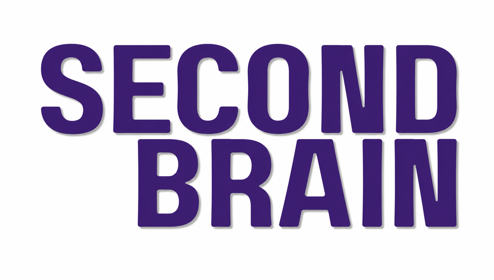

# SecondBrain

<p align="center">
  
  
</p>

SecondBrain is an AI-powered study assistant designed for high school and university students. Its purpose is to help students organize their coursework, understand difficult concepts, prepare for exams, and build stronger study habits.

The project is founded on a simple principle: AI should support learning, not replace it. SecondBrain will guide students through problems, ask useful questions, explain ideas in different ways, and help create study plans. It will not complete coursework, assessments, or exams on a student's behalf. Educators remain essential to the learning process, and this application is intended to complement their teaching.

## Project goals

- Organize classes, schedules, assignments, and exam dates.
- Create personalized study plans based on a student's available time and priorities.
- Explain course material at an appropriate level without simply supplying answers.
- Generate practice questions, quizzes, flashcards, and review sessions.
- Encourage active recall, critical thinking, and independent problem-solving.
- Help students identify topics that need additional practice.
- Make responsible AI assistance accessible across mobile and web platforms.

## Current status

SecondBrain is in early development. The current application provides the foundation for navigating between screens and creating a schedule with class information. AI assistance, authentication, persistent storage, and backend services are planned features and have not yet been implemented.

## Current technology

The client application currently uses:

- **TypeScript** for safer, more maintainable application code.
- **React 19** for building the component-based user interface.
- **React Native 0.86** for creating native Android and iOS experiences from a shared codebase.
- **Expo SDK 57** for development tooling, device capabilities, builds, and cross-platform support.
- **Expo Router** for file-based navigation and screen transitions.
- **React Native Paper** and **Expo UI** for interface components.
- **React Native Reanimated** and **React Native Gesture Handler** for animations and interactions.
- **React Native Web** so the application can also run in a browser.

## Planned architecture

The mobile application should communicate with a secure backend rather than calling an AI provider directly. This prevents provider API keys from being exposed in the app and gives the project one place to handle authentication, validation, rate limits, safety policies, and usage tracking.

```text
Expo / React Native application
              |
              | HTTPS requests
              v
       Application API
      /               \
Database         AI provider
                 OpenAI, Gemini,
                 or another provider
```

### Backend options

The API can be developed using either of these approaches:

- **Python with FastAPI**: a strong option for AI workflows, data processing, typed request validation, and access to the broader Python machine-learning ecosystem.
- **TypeScript/JavaScript with Node.js**: a strong option for sharing types and language knowledge between the React Native client and backend. Frameworks such as Express, Fastify, or NestJS could provide the API layer.

The backend will expose endpoints for features such as schedules, study sessions, course materials, quizzes, and AI-guided conversations. It will also be responsible for protecting credentials and ensuring that student data is handled appropriately.

### AI provider options

The initial candidates are **OpenAI** and **Google Gemini**, but the architecture should avoid coupling the application to one provider. The final provider should be selected through practical evaluation of:

- Quality of explanations and tutoring behavior.
- Ability to follow educational guardrails.
- Structured output and tool-calling support.
- Privacy, security, and data-retention policies.
- Latency, reliability, context limits, and cost.
- Support for text, images, documents, and other useful learning formats.

A provider-independent service layer would make it possible to test alternatives or change providers as the needs of the application evolve.

## Responsible AI principles

SecondBrain should be designed to:

- Guide students toward an answer instead of doing assessed work for them.
- Prefer hints, questions, examples, and step-by-step explanations.
- Clearly communicate that AI output can be incomplete or incorrect.
- Encourage students to verify important information with course materials and educators.
- Respect academic-integrity expectations established by schools and instructors.
- Protect student information and collect only the data required by the product.
- Include additional safeguards when the application is used by minors.

## Future roadmap

- Persist schedules, courses, and assignments.
- Add accounts, authentication, and student profiles.
- Build secure backend endpoints.
- Integrate and evaluate AI providers.
- Add guided tutoring and concept explanations.
- Generate quizzes, flashcards, and practice sessions.
- Support document or course-note uploads with source-grounded answers.
- Add progress tracking, reminders, and study recommendations.
- Introduce automated tests, monitoring, and AI-quality evaluations.

## Getting started

### Requirements

- Node.js 22.13 or newer
- npm
- Expo Go, an Android emulator, an iOS simulator, or a web browser

### Run the application

```bash
npm install
npx expo start
```

You can also start a specific platform:

```bash
npm run android
npm run ios
npm run web
```

## Contributing

Contributions should support the project's educational purpose and responsible-AI principles. New AI features should be evaluated not only for whether they work, but also for whether they help students learn independently and safely.

## License

See [LICENSE](./LICENSE) for license information.
